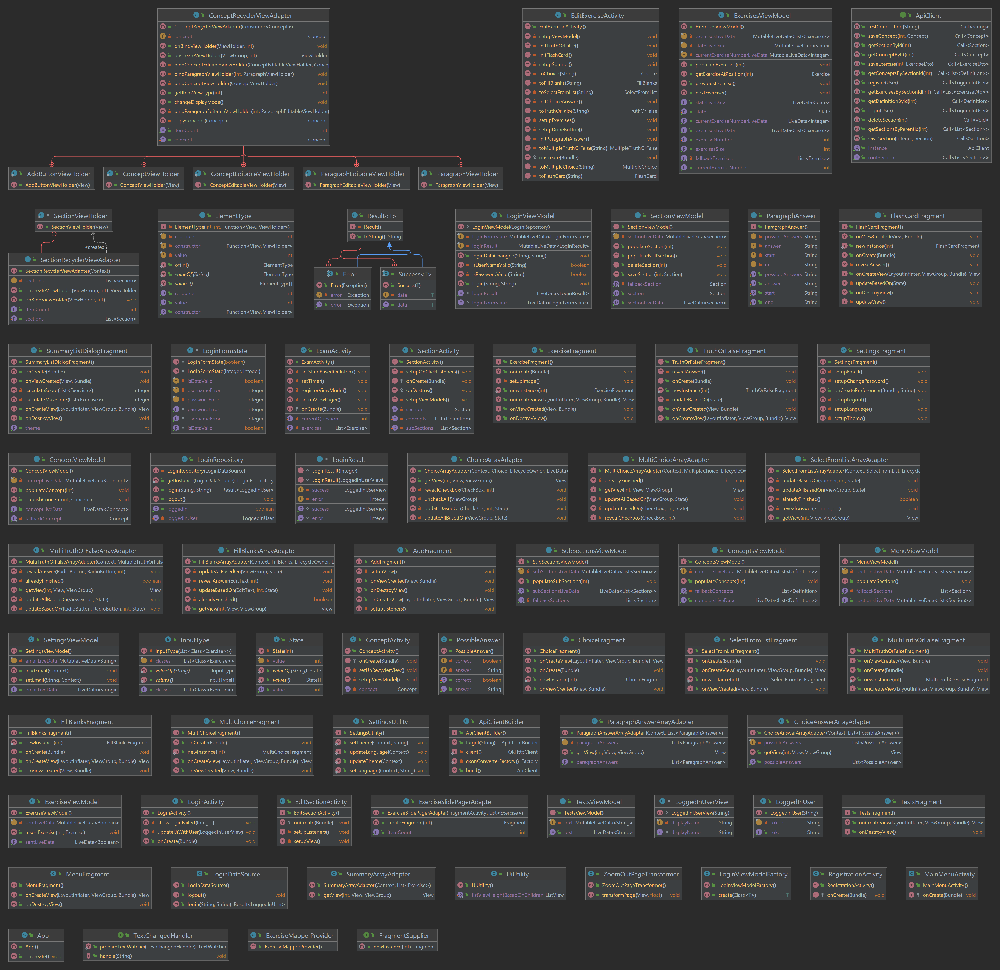

# Aplikacja wspomagająca naukę do egzaminu - aplikacja mobilna

Aplikacja zbierająca i sprawdzająca wiedzę z zakresu studiów
licencjackich w postaci scenariuszy testowych (ciągów pytań)
na różnych poziomach trudności. System ten powinien w szczególności
odsyłać do niezbędnych źródeł wiedzy: materiałów z wykładów i ćwiczeń,
literatury pomocniczej, GITów i innych zasobów sieci.

# Data Transfer Model (DTOs)
DTOs i diagram UML są  dostępne [tutaj](https://gitlab-stud.elka.pw.edu.pl/bkrawcz1/pzsp2-22z-model).

# REST API
Aplikacja łączy się z WebSerwisem korzystając z REST API.
Repozytorium z serwisem internetowym dostępne jest [tutaj](https://gitlab-stud.elka.pw.edu.pl/bkrawcz1/pzsp2-22z-api).

# Model Komponentów - Android
Na Androidzie wykorzystujemy architekturę aplikacji polecaną przez twórców Androida - (Model - View - ViewModel) - [link](https://developer.android.com/topic/architecture): 


Wydzielimy główne komponenty:

    Warstwa UI - odpowiedzialna za wyświetlanie oraz interakcję z użytkownikiem

        Elementy UI

        Elementy przechowujące stan aplikacji

    Warstwa domenowa - odpowiedzialna za obsługę logiki biznesowej

    Warstwa Danych - odpowiedzialna za przechowywanie oraz aktualizację danych

# Diagram klas



# Budowanie i uruchomienie
Do poprawnego zbudowania i uruchomienia projektu wymagane jest Java17 i AndroidSDK dlatego najlepiej
skorzystać z AndroidStudio gdzie projekt jest poprawnie rozpoznawany jako projekt aplikacji mobilnej
i budowany.

**Uwaga:** Kiedy budujesz aplikacje może wystąpić problem z niespełnionymi zależnościami.
W takim przypadku, powinieneś zbudować najpierw [model danych](https://gitlab-stud.elka.pw.edu.pl/bkrawcz1/pzsp2-22z-model) i wygenerować plik jar oraz opublikować w lokalnym repozytorium Mavena:
```bash
./gradlew publishToMavenLocal
```

# Uruchomienie testów
<TODO>

## Pokrycie testami
<TODO>

# Ponowne wygenerowanie dokumentacji
Javadocs są dostępne [tutaj](./javadoc/index.html).
Aby ponownie wygenerować docsy należy wywołać:
```bash
<TODO>
```
